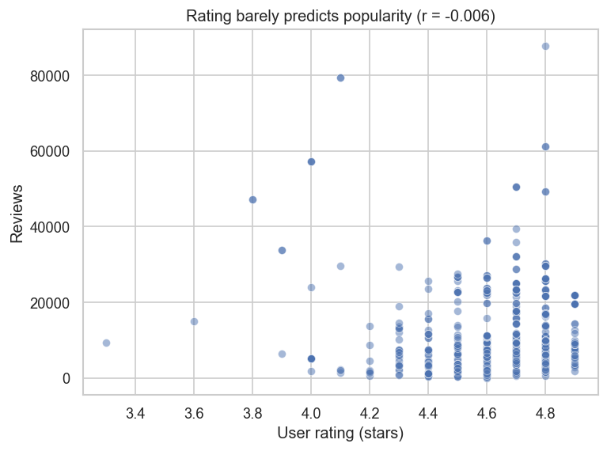
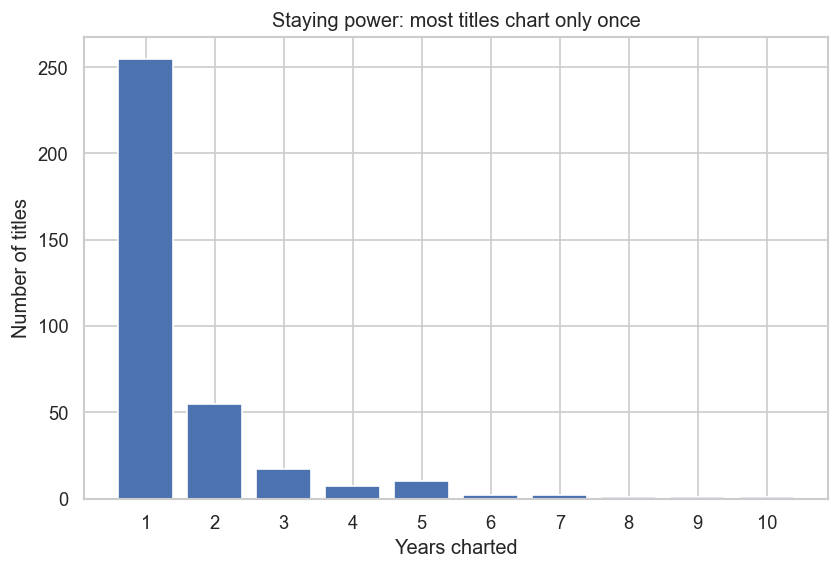
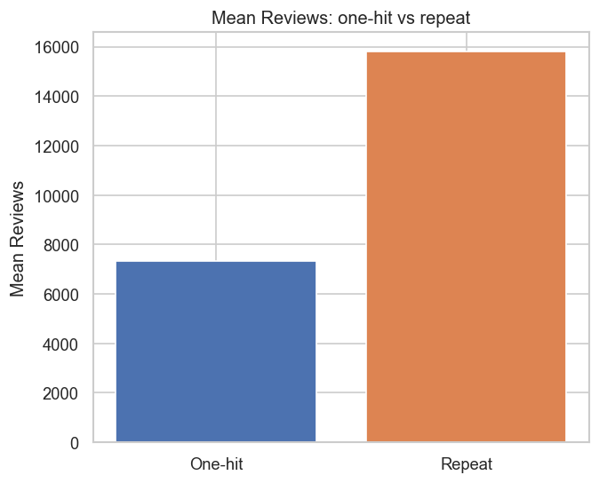

# Amazon Bestsellers: Does Quality Sell, or Does Staying Power Win?

A data-story exploring Amazon's Top 50 bestselling books each year from 2009–2019.

> **The question:** A book's star rating barely predicts how popular it becomes — so what *actually* makes a bestseller last? This project follows the data from a counter-intuitive hook (quality ≠ popularity) to the real driver of lasting success: **staying power across years.**

## Dataset

[Amazon Top 50 Bestselling Books 2009–2019](https://www.kaggle.com/datasets/sootersaalu/amazon-top-50-bestselling-books-2009-2019) (Kaggle) — 550 rows, 7 columns: title, author, user rating, review count, price, year, and genre.

## Project structure

```
amazon-bestsellers-analysis/
├── data/bestsellers.csv          # raw dataset
├── src/bestsellers/              # reusable analysis toolkit
│   ├── data.py                   # load, clean, feature engineering
│   ├── analysis.py               # EDA helpers (correlations, staying power, authors)
│   └── viz.py                    # styled plotting helpers (one shared theme)
├── tests/                        # pytest unit tests for the data layer
├── scripts/export_figures.py     # regenerate the README charts
├── images/                       # exported charts
└── notebooks/
    └── bestsellers_analysis.ipynb   # the data story
```

## Getting started

```bash
python -m venv .venv
.venv\Scripts\activate        # Windows
pip install -r requirements.txt
jupyter notebook notebooks/bestsellers_analysis.ipynb
```

Run the tests:

```bash
pytest
```

## Key findings

### 1. Quality ≠ popularity

A book's star rating is **essentially uncorrelated** with its review count (Pearson `r ≈ -0.006`). Knowing how highly a book is rated tells you almost nothing about how many readers it reached. Price barely moves the needle either (`r ≈ -0.11`).



The cloud is flat: there's no upward drift from low ratings to high. So if quality doesn't explain which books become hits — what does?

### 2. Staying power is the real divide

Reframing from *how good* to *how long*: **73% of the 351 titles chart in only a single year**. A small core endures — a handful reach five years or more, and one title (the *Publication Manual of the APA*) holds on for all ten.



### 3. Repeat bestsellers aren't better — they last

Split the books into one-hit titles and repeat bestsellers (two or more years) and the argument lands in one chart. Both groups share the **same mean rating (~4.6 stars)** — repeat bestsellers are *not* better-rated books — yet they carry **roughly twice the reviews** (≈15,800 vs ≈7,300).



Popularity doesn't come from being rated higher; it compounds from staying on the chart year after year.

### Two routes to the top

Among authors, dominance comes two ways: **volume** (Jeff Kinney — 12 different *Diary of a Wimpy Kid* titles) or **endurance** (Suzanne Collins — just a few *Hunger Games* titles charting again and again across the decade).

**The takeaway:** on this chart, lasting success is less about how good a book is and more about how long it stays in front of readers — staying power wins.

> Charts are regenerated from the analysis module with `python scripts/export_figures.py`.

## About

A portfolio reworking of a university data-science assignment (CSCU9M3, University of Stirling), rebuilt with a reusable code module, unit tests, and a tighter narrative.
